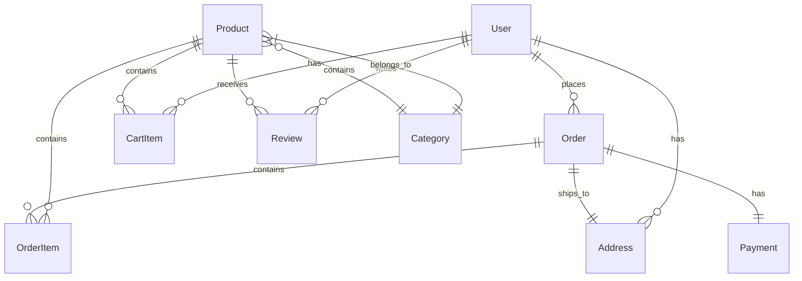

# Architecture Documentation

This document provides a comprehensive overview of the e-commerce platform architecture, including system design, technology choices, and implementation patterns.

## 📋 Table of Contents

- [System Overview](#system-overview)
- [Architecture Patterns](#architecture-patterns)
- [Technology Stack](#technology-stack)
- [Database Design](#database-design)
- [API Design](#api-design)
- [Frontend Architecture](#frontend-architecture)
- [Backend Architecture](#backend-architecture)
- [Security Architecture](#security-architecture)
- [Deployment Architecture](#deployment-architecture)
- [Performance Considerations](#performance-considerations)

## 🏗️ System Overview

### High-Level Architecture

```
┌─────────────────┐    ┌─────────────────┐    ┌─────────────────┐
│   Client Apps   │    │   Admin Panel   │    │  Mobile Apps    │
│   (React/Next)  │    │   (React/Next)  │    │   (Future)      │
└─────────┬───────┘    └─────────┬───────┘    └─────────┬───────┘
          │                      │                      │
          └─────────┬────────────┴──────────────────────┘
                    │
          ┌─────────▼───────┐
          │  Load Balancer  │
          │    (Nginx)      │
          └─────────┬───────┘
                    │
          ┌─────────▼───────┐
          │   API Gateway   │
          │  (Express.js)   │
          └─────────┬───────┘
                    │
    ┌───────────────┼───────────────┐
    │               │               │
┌───▼────┐ ┌────────▼────┐ ┌────────▼────┐
│Product │ │   User      │ │   Order     │
│Service │ │  Service    │ │  Service    │
└───┬────┘ └─────┬───────┘ └─────┬───────┘
    │            │               │
    └─────┬──────┴───────┬───────┘
          │              │
    ┌─────▼─────┐ ┌──────▼──────┐
    │PostgreSQL │ │    Redis    │
    │ Database  │ │   Cache     │
    └───────────┘ └─────────────┘
```

### Core Principles

1. **Microservices Architecture**: Modular services for scalability
2. **RESTful API Design**: Consistent and predictable interfaces
3. **Database Per Service**: Independent data storage
4. **Event-Driven Communication**: Asynchronous service communication
5. **CQRS Pattern**: Separate read and write operations where beneficial
6. **Caching Strategy**: Multi-level caching for performance

## 🔄 Architecture Patterns

### 1. Layered Architecture
```
┌─────────────────────────────────┐
│        Presentation Layer       │ ← React Components, Pages
├─────────────────────────────────┤
│         Business Layer          │ ← Services, Hooks, State Management
├─────────────────────────────────┤
│         Data Access Layer       │ ← API Clients, Repository Pattern
├─────────────────────────────────┤
│         Infrastructure Layer    │ ← External APIs, Database, Cache
└─────────────────────────────────┘
```

### 2. Domain-Driven Design (DDD)
- **Bounded Contexts**: User Management, Product Catalog, Order Management, Payment Processing
- **Aggregates**: User, Product, Order, Cart
- **Value Objects**: Money, Address, Email
- **Domain Services**: Pricing Service, Inventory Service

### 3. CQRS (Command Query Responsibility Segregation)
```
Commands (Write):           Queries (Read):
┌──────────────┐           ┌──────────────┐
│ Create Order │           │ View Products│
│ Update User  │           │ Order History│
│ Add Product  │           │ User Profile │
└──────┬───────┘           └──────┬───────┘
       │                          │
       ▼                          ▼
┌──────────────┐           ┌──────────────┐
│ Write Store  │           │  Read Store  │
│ (PostgreSQL) │           │   (Cache)    │
└──────────────┘           └──────────────┘
```

## 💻 Technology Stack

### Frontend Stack
```typescript
// Next.js with React 18
{
  "framework": "Next.js 14",
  "react": "18.x",
  "typescript": "5.x",
  "styling": "Tailwind CSS + CSS Modules",
  "stateManagement": "Zustand + React Query",
  "forms": "React Hook Form + Zod",
  "testing": "Jest + React Testing Library + Playwright"
}
```

### Backend Stack
```typescript
// Node.js with Express
{
  "runtime": "Node.js 18+",
  "framework": "Express.js",
  "database": "PostgreSQL + Redis",
  "orm": "Prisma",
  "authentication": "JWT + Passport.js",
  "validation": "Zod",
  "testing": "Jest + Supertest",
  "documentation": "Swagger/OpenAPI"
}
```

### Infrastructure Stack
```yaml
# Docker & Kubernetes
containerization: "Docker"
orchestration: "Kubernetes"
reverse_proxy: "Nginx"
monitoring: "Prometheus + Grafana"
logging: "ELK Stack"
ci_cd: "GitHub Actions"
cloud: "AWS/GCP/Azure"
```

## 🗄️ Database Design

### Entity Relationship Diagram


### Database Schema

#### Users Table
```sql
CREATE TABLE users (
    id UUID PRIMARY KEY DEFAULT gen_random_uuid(),
    email VARCHAR(255) UNIQUE NOT NULL,
    password_hash VARCHAR(255) NOT NULL,
    first_name VARCHAR(100) NOT NULL,
    last_name VARCHAR(100) NOT NULL,
    phone VARCHAR(20),
    is_verified BOOLEAN DEFAULT FALSE,
    role VARCHAR(20) DEFAULT 'customer',
    created_at TIMESTAMP DEFAULT NOW(),
    updated_at TIMESTAMP DEFAULT NOW()
);
```

#### Products Table
```sql
CREATE TABLE products (
    id UUID PRIMARY KEY DEFAULT gen_random_uuid(),
    name VARCHAR(255) NOT NULL,
    description TEXT,
    price DECIMAL(10, 2) NOT NULL,
    category_id UUID REFERENCES categories(id),
    stock_quantity INTEGER NOT NULL DEFAULT 0,
    sku VARCHAR(100) UNIQUE NOT NULL,
    images JSONB,
    is_active BOOLEAN DEFAULT TRUE,
    created_at TIMESTAMP DEFAULT NOW(),
    updated_at TIMESTAMP DEFAULT NOW()
);
```

#### Orders Table
```sql
CREATE TABLE orders (
    id UUID PRIMARY KEY DEFAULT gen_random_uuid(),
    user_id UUID REFERENCES users(id),
    status VARCHAR(20) DEFAULT 'pending',
    total_amount DECIMAL(10, 2) NOT NULL,
    shipping_address JSONB NOT NULL,
    billing_address JSONB NOT NULL,
    created_at TIMESTAMP DEFAULT NOW(),
    updated_at TIMESTAMP DEFAULT NOW()
);
```

### Indexing Strategy
```sql
-- Performance indexes
CREATE INDEX idx_products_category ON products(category_id);
CREATE INDEX idx_products_price ON products(price);
CREATE INDEX idx_orders_user ON orders(user_id);
CREATE INDEX idx_orders_status ON orders(status);
CREATE INDEX idx_orders_created ON orders(created_at);

-- Full-text search
CREATE INDEX idx_products_search ON products USING gin(
    to_tsvector('english', name || ' ' || description)
);
```

## 🔌 API Design

### RESTful API Structure
```
/api/v1/
├── /auth
│   ├── POST /login
│   ├── POST /register
│   ├── POST /refresh
│   └── POST /logout
├── /users
│   ├── GET /profile
│   ├── PUT /profile
│   └── DELETE /account
├── /products
│   ├── GET /
│   ├── GET /:id
│   ├── POST / (admin)
│   ├── PUT /:id (admin)
│   └── DELETE /:id (admin)
├── /cart
│   ├── GET /
│   ├── POST /items
│   ├── PUT /items/:id
│   └── DELETE /items/:id
└── /orders
    ├── GET /
    ├── POST /
    ├── GET /:id
    └── PUT /:id/status (admin)
```

### API Response Format
```typescript
// Success Response
interface ApiResponse<T> {
  success: true;
  data: T;
  meta?: {
    total?: number;
    page?: number;
    limit?: number;
  };
}

// Error Response
interface ApiError {
  success: false;
  error: {
    code: string;
    message: string;
    details?: unknown;
  };
}
```

### Authentication Flow
```typescript
// JWT Token Structure
interface JWTPayload {
  sub: string;        // User ID
  email: string;      // User email
  role: string;       // User role
  iat: number;        // Issued at
  exp: number;        // Expires at
}

// Authentication Middleware
const authenticateToken = async (req: Request, res: Response, next: NextFunction) => {
  const token = req.headers.authorization?.split(' ')[1];
  
  if (!token) {
    return res.status(401).json({ error: 'Access token required' });
  }
  
  try {
    const decoded = jwt.verify(token, process.env.JWT_SECRET!) as JWTPayload;
    req.user = decoded;
    next();
  } catch (error) {
    return res.status(403).json({ error: 'Invalid token' });
  }
};
```

## ⚛️ Frontend Architecture

### Component Architecture
```
src/
├── app/                    # Next.js app directory
│   ├── (auth)/            # Auth route group
│   ├── (shop)/            # Shop route group
│   └── admin/             # Admin routes
├── components/
│   ├── ui/                # Base UI components
│   ├── forms/             # Form components
│   ├── layout/            # Layout components
│   └── features/          # Feature-specific components
├── hooks/                 # Custom React hooks
├── lib/                   # Utility libraries
├── stores/                # State management
├── types/                 # TypeScript definitions
└── utils/                 # Utility functions
```

### State Management Strategy
```typescript
// Zustand Store Example
interface CartStore {
  items: CartItem[];
  total: number;
  addItem: (product: Product) => void;
  removeItem: (productId: string) => void;
  updateQuantity: (productId: string, quantity: number) => void;
  clearCart: () => void;
}

const useCartStore = create<CartStore>((set, get) => ({
  items: [],
  total: 0,
  addItem: (product) => {
    // Implementation
  },
  // ... other actions
}));
```

### Data Fetching Pattern
```typescript
// React Query Hook
export const useProducts = (filters: ProductFilters) => {
  return useQuery({
    queryKey: ['products', filters],
    queryFn: () => productApi.getProducts(filters),
    staleTime: 5 * 60 * 1000, // 5 minutes
  });
};

// Server Component (Next.js)
export default async function ProductsPage({
  searchParams,
}: {
  searchParams: { category?: string; page?: string };
}) {
  const products = await productApi.getProducts({
    category: searchParams.category,
    page: Number(searchParams.page) || 1,
  });

  return <ProductList products={products} />;
}
```

## 🖥️ Backend Architecture

### Service Layer Pattern
```typescript
// Service Interface
interface ProductService {
  getAll(filters: ProductFilters): Promise<Product[]>;
  getById(id: string): Promise<Product | null>;
  create(data: CreateProductDto): Promise<Product>;
  update(id: string, data: UpdateProductDto): Promise<Product>;
  delete(id: string): Promise<void>;
}

// Service Implementation
export class ProductServiceImpl implements ProductService {
  constructor(
    private productRepository: ProductRepository,
    private cacheService: CacheService
  ) {}

  async getAll(filters: ProductFilters): Promise<Product[]> {
    const cacheKey = `products:${JSON.stringify(filters)}`;
    
    // Try cache first
    const cached = await this.cacheService.get(cacheKey);
    if (cached) return JSON.parse(cached);

    // Fetch from database
    const products = await this.productRepository.findMany(filters);
    
    // Cache the result
    await this.cacheService.set(cacheKey, JSON.stringify(products), 300);
    
    return products;
  }
}
```

### Repository Pattern
```typescript
// Repository Interface
interface ProductRepository {
  findMany(filters: ProductFilters): Promise<Product[]>;
  findById(id: string): Promise<Product | null>;
  create(data: CreateProductData): Promise<Product>;
  update(id: string, data: UpdateProductData): Promise<Product>;
  delete(id: string): Promise<void>;
}

// Prisma Implementation
export class PrismaProductRepository implements ProductRepository {
  constructor(private prisma: PrismaClient) {}

  async findMany(filters: ProductFilters): Promise<Product[]> {
    return this.prisma.product.findMany({
      where: {
        category: filters.category,
        price: {
          gte: filters.minPrice,
          lte: filters.maxPrice,
        },
        isActive: true,
      },
      include: {
        category: true,
        reviews: {
          select: {
            rating: true,
          },
        },
      },
    });
  }
}
```

## 🔒 Security Architecture

### Authentication & Authorization
```typescript
// Role-Based Access Control
enum UserRole {
  CUSTOMER = 'customer',
  ADMIN = 'admin',
  MODERATOR = 'moderator',
}

const requireRole = (roles: UserRole[]) => {
  return (req: AuthenticatedRequest, res: Response, next: NextFunction) => {
    if (!roles.includes(req.user.role)) {
      return res.status(403).json({ error: 'Insufficient permissions' });
    }
    next();
  };
};

// Usage
app.delete('/api/products/:id', 
  authenticateToken,
  requireRole([UserRole.ADMIN]),
  productController.delete
);
```

### Input Validation
```typescript
// Zod Schema Example
const createProductSchema = z.object({
  name: z.string().min(1).max(255),
  description: z.string().max(2000),
  price: z.number().positive(),
  categoryId: z.string().uuid(),
  stockQuantity: z.number().int().min(0),
});

// Validation Middleware
const validateBody = (schema: z.ZodSchema) => {
  return (req: Request, res: Response, next: NextFunction) => {
    try {
      req.body = schema.parse(req.body);
      next();
    } catch (error) {
      if (error instanceof z.ZodError) {
        return res.status(400).json({
          error: 'Validation failed',
          details: error.errors,
        });
      }
      next(error);
    }
  };
};
```

### Security Headers
```typescript
// Security Middleware
app.use(helmet({
  contentSecurityPolicy: {
    directives: {
      defaultSrc: ["'self'"],
      styleSrc: ["'self'", "'unsafe-inline'"],
      scriptSrc: ["'self'"],
      imgSrc: ["'self'", "data:", "https:"],
    },
  },
  hsts: {
    maxAge: 31536000,
    includeSubDomains: true,
    preload: true,
  },
}));
```

## 🚀 Deployment Architecture

### Container Strategy
```dockerfile
# Multi-stage Dockerfile
FROM node:18-alpine AS base
WORKDIR /app
COPY package*.json ./
RUN npm ci --only=production

FROM node:18-alpine AS build
WORKDIR /app
COPY package*.json ./
RUN npm ci
COPY . .
RUN npm run build

FROM base AS runtime
COPY --from=build /app/dist ./dist
EXPOSE 3000
CMD ["npm", "start"]
```

### Kubernetes Deployment
```yaml
apiVersion: apps/v1
kind: Deployment
metadata:
  name: ecommerce-api
spec:
  replicas: 3
  selector:
    matchLabels:
      app: ecommerce-api
  template:
    metadata:
      labels:
        app: ecommerce-api
    spec:
      containers:
      - name: api
        image: ecommerce/api:latest
        ports:
        - containerPort: 3000
        env:
        - name: DATABASE_URL
          valueFrom:
            secretKeyRef:
              name: db-secret
              key: url
```

### CI/CD Pipeline
```yaml
# GitHub Actions Workflow
name: Deploy to Production

on:
  push:
    branches: [main]

jobs:
  test:
    runs-on: ubuntu-latest
    steps:
      - uses: actions/checkout@v3
      - uses: actions/setup-node@v3
      - run: npm ci
      - run: npm test
      - run: npm run lint

  build:
    needs: test
    runs-on: ubuntu-latest
    steps:
      - uses: actions/checkout@v3
      - uses: docker/build-push-action@v3
        with:
          push: true
          tags: ecommerce/api:latest

  deploy:
    needs: build
    runs-on: ubuntu-latest
    steps:
      - run: kubectl apply -f k8s/
```

## ⚡ Performance Considerations

### Caching Strategy
```typescript
// Multi-level Caching
interface CacheStrategy {
  browser: 'Client-side caching with React Query';
  cdn: 'Static assets via CloudFront';
  application: 'Redis for API responses';
  database: 'Query result caching';
}

// Cache Implementation
class CacheService {
  async getOrSet<T>(
    key: string,
    factory: () => Promise<T>,
    ttl: number = 300
  ): Promise<T> {
    const cached = await this.redis.get(key);
    
    if (cached) {
      return JSON.parse(cached);
    }
    
    const result = await factory();
    await this.redis.setex(key, ttl, JSON.stringify(result));
    
    return result;
  }
}
```

### Database Optimization
```sql
-- Query Optimization Examples

-- Efficient product search with pagination
SELECT p.*, c.name as category_name
FROM products p
JOIN categories c ON p.category_id = c.id
WHERE p.is_active = true
  AND ($1::text IS NULL OR p.category_id = $1::uuid)
  AND ($2::text IS NULL OR p.name ILIKE '%' || $2 || '%')
ORDER BY p.created_at DESC
LIMIT $3 OFFSET $4;

-- Efficient order statistics
SELECT 
  DATE_TRUNC('day', created_at) as date,
  COUNT(*) as order_count,
  SUM(total_amount) as revenue
FROM orders
WHERE created_at >= $1
GROUP BY DATE_TRUNC('day', created_at)
ORDER BY date;
```

### Frontend Performance
```typescript
// Code Splitting
const ProductPage = lazy(() => import('./pages/ProductPage'));
const CartPage = lazy(() => import('./pages/CartPage'));

// Image Optimization
const ProductImage = ({ src, alt }: { src: string; alt: string }) => (
  <Image
    src={src}
    alt={alt}
    width={300}
    height={300}
    placeholder="blur"
    blurDataURL="data:image/jpeg;base64,..."
    sizes="(max-width: 768px) 100vw, (max-width: 1200px) 50vw, 33vw"
  />
);

// Virtual Scrolling for Large Lists
const VirtualizedProductList = ({ products }: { products: Product[] }) => (
  <FixedSizeList
    height={600}
    itemCount={products.length}
    itemSize={200}
    itemData={products}
  >
    {ProductRow}
  </FixedSizeList>
);
```

## 📊 Monitoring & Observability

### Metrics Collection
```typescript
// Application Metrics
const prometheus = require('prom-client');

const httpRequestDuration = new prometheus.Histogram({
  name: 'http_request_duration_seconds',
  help: 'Duration of HTTP requests in seconds',
  labelNames: ['method', 'route', 'status'],
});

// Custom Business Metrics
const orderMetrics = {
  totalOrders: new prometheus.Counter({
    name: 'orders_total',
    help: 'Total number of orders',
  }),
  orderValue: new prometheus.Histogram({
    name: 'order_value_dollars',
    help: 'Distribution of order values',
  }),
};
```

### Logging Strategy
```typescript
// Structured Logging
import winston from 'winston';

const logger = winston.createLogger({
  format: winston.format.combine(
    winston.format.timestamp(),
    winston.format.errors({ stack: true }),
    winston.format.json()
  ),
  transports: [
    new winston.transports.Console(),
    new winston.transports.File({ filename: 'app.log' })
  ],
});

// Usage
logger.info('Order created', {
  orderId: order.id,
  userId: order.userId,
  amount: order.total,
  items: order.items.length,
});
```

This architecture provides a solid foundation for building a scalable, maintainable, and performant e-commerce platform while following modern best practices and design patterns.